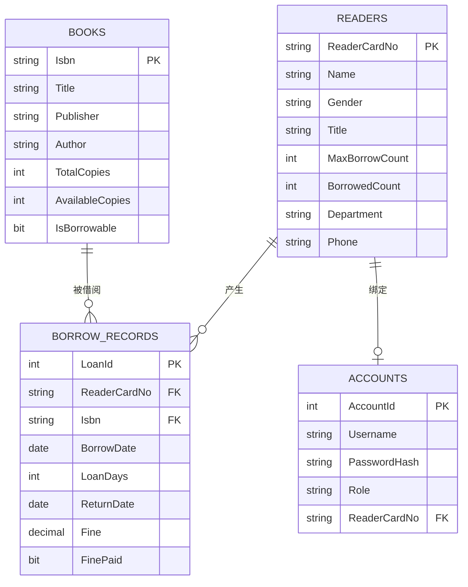

# 数据库设计报告

## 1. 需求分析

系统面向图书管理员和读者。管理员负责图书、读者、账号和借阅记录维护；读者负责查询个人信息、借阅记录和逾期罚款。核心业务包括图书检索、新增、编辑、删除，读者检索、新增、编辑、删除，借书、还书、逾期罚款计算和逾期未还查询。

## 2. E-R 设计



## 3. 关系模式

- 图书信息表：`Books(Isbn, Title, Publisher, Author, TotalCopies, AvailableCopies, IsBorrowable, CreatedAt, UpdatedAt)`
- 读者信息表：`Readers(ReaderCardNo, Name, Gender, Title, MaxBorrowCount, BorrowedCount, Department, Phone, CreatedAt, UpdatedAt)`
- 登陆表：`Accounts(AccountId, Username, PasswordHash, PasswordSalt, Role, ReaderCardNo, IsEnabled, CreatedAt)`
- 借阅信息表：`BorrowRecords(LoanId, ReaderCardNo, Isbn, BorrowDate, LoanDays, ReturnDate, Fine, FinePaid, Remark, CreatedAt)`

## 4. 完整性设计

- 实体完整性：四张核心表均设置主码，`Books.Isbn`、`Readers.ReaderCardNo`、`Accounts.AccountId`、`BorrowRecords.LoanId`。
- 参照完整性：`BorrowRecords.ReaderCardNo` 引用读者表，`BorrowRecords.Isbn` 引用图书表，`Accounts.ReaderCardNo` 引用读者表。
- 用户自定义完整性：
  - 图书馆藏数量和可借数量不能小于 0，且可借数量不能大于馆藏数量。
  - 读者性别限定为 `男`、`女`、`其他`。
  - 读者可借数量限定为 0 到 20。
  - 借阅期限限定为 1 到 180 天。
  - 罚款金额不能小于 0。
  - 归还日期不能早于借出日期。
- 非空约束：书名、出版社、作者、读者姓名、部门、账号、密码哈希、权限等均非空。
- 默认约束：图书默认可借，借阅日期默认当天，借阅期限默认 30 天，罚款默认 0。

## 5. 数据库对象

- 视图：`vw_OverdueBorrowRecords` 查询所有逾期未归还图书，返回借阅记录号、ISBN、书名、读者、借出日期、应还日期、逾期天数、预计罚款。
- 索引：
  - `IX_Books_TitleAuthor` 提升书名、作者检索速度。
  - `IX_Readers_Name` 提升读者姓名检索速度。
  - `IX_BorrowRecords_Reader_ReturnDate` 提升读者当前借阅查询。
  - `IX_BorrowRecords_Isbn_ReturnDate` 提升图书借阅状态查询。
- 存储过程：
  - `sp_BorrowBook`：借书事务，检查罚款、库存和读者可借数量。
  - `sp_ReturnBook`：还书事务，计算逾期罚款并同步库存和已借数量。
  - `sp_PayReaderFine`：缴清指定读者未缴罚款。

## 6. 典型 SQL

```sql
-- 图书模糊查询
SELECT Isbn, Title, Publisher, Author, TotalCopies, AvailableCopies
FROM dbo.Books
WHERE Title LIKE N'%数据库%' OR Author LIKE N'%王珊%' OR Isbn LIKE N'%978%';

-- 查询读者未归还图书
SELECT br.LoanId, br.Isbn, b.Title, br.BorrowDate
FROM dbo.BorrowRecords br
JOIN dbo.Books b ON b.Isbn = br.Isbn
WHERE br.ReaderCardNo = N'SYSU-SZ-2024001' AND br.ReturnDate IS NULL;

-- 查询全部逾期未还
SELECT * FROM dbo.vw_OverdueBorrowRecords ORDER BY OverdueDays DESC;
```
