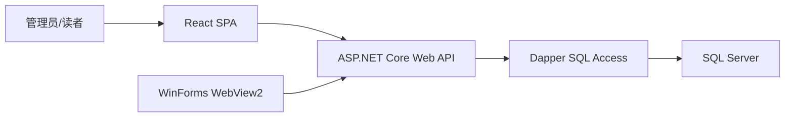

# 系统设计文档

## 1. 总体架构

系统采用前后端分离开发、后端统一托管前端构建产物的方式。开发时 React 通过 Vite 代理访问 ASP.NET Core API；交付时 React 构建到 `server/wwwroot`，由后端直接提供 Web 页面。桌面端使用 WinForms WebView2，启动本地后端服务并打开同一套 Web 应用。

## 2. 模块划分

- 登录认证模块：账号密码登录、JWT 令牌、管理员/读者权限区分。
- 图书管理模块：图书检索、新增、编辑、删除，支持书名、作者、ISBN 模糊查询。
- 读者管理模块：读者检索、新增、编辑、删除，显示已借数量和未缴罚款。
- 账号管理模块：管理员维护登录账号、权限和读者绑定关系。
- 借阅管理模块：借阅记录 CRUD，办理借书、办理还书。
- 逾期查询模块：调用数据库视图查询到期未归还图书。
- 统计看板模块：展示馆藏、可借、借出、逾期、罚款和借阅趋势。
- 桌面壳模块：启动本地服务并通过 WebView2 呈现 Web 应用。

## 3. 权限设计

- 管理员：
  - 可访问图书、读者、账号、借阅记录、逾期查询、统计看板。
  - 可执行新增、编辑、删除、借书、还书、缴罚款。
- 读者：
  - 可查看图书、个人信息、个人借阅记录、个人逾期记录。
  - 可在图书列表中自助借书，系统自动使用当前登录账号绑定的借书证号。
  - 不允许新增、编辑、删除系统数据。

## 4. API 设计

- `POST /api/auth/login`：登录，返回 token、账号、角色、读者证号。
- `GET /api/auth/me`：获取当前用户信息。
- `GET/POST/PUT/DELETE /api/books`：图书 CRUD。
- `GET/POST/PUT/DELETE /api/readers`：读者 CRUD。
- `POST /api/readers/{cardNo}/pay-fine`：缴清罚款。
- `GET/POST/PUT/DELETE /api/accounts`：账号 CRUD。
- `GET/POST/PUT/DELETE /api/borrow-records`：借阅记录 CRUD。
- `POST /api/borrow-records/borrow`：办理借书。
- `POST /api/borrow-records/{loanId}/return`：办理还书。
- `GET /api/reports/overdue`：查询到期未还。
- `GET /api/reports/dashboard`：统计看板。

## 5. 核心业务流程

### 借书流程

1. 管理员可选择读者和图书办理借书；读者可在图书列表中为自己办理借书。
2. 后端调用 `sp_BorrowBook`。
3. 数据库检查读者是否存在、图书是否存在、是否有未缴罚款、是否超过可借数量、图书是否有库存。
4. 事务内更新图书可借数量、读者已借数量并新增借阅记录。

### 还书流程

1. 管理员选择未归还借阅记录。
2. 后端调用 `sp_ReturnBook`。
3. 数据库根据借出日期和借阅期限计算罚款。
4. 事务内更新归还日期、罚款、图书可借数量和读者已借数量。

### 删除限制

- 删除图书前检查是否存在未归还借阅记录。
- 删除读者前检查是否存在未归还借阅记录。
- 若存在未归还记录，系统返回冲突提示，不允许删除。

## 6. 测试说明

- 数据库测试：验证主码、外码、CHECK、默认值、视图、索引和存储过程。
- 接口测试：验证登录、权限、CRUD、借书、还书、缴罚款、逾期查询。
- 前端测试：验证管理员和读者两个角色的菜单、表格、表单、删除确认和状态刷新。
- 桌面测试：验证 WebView2 能启动本地服务并打开系统。
